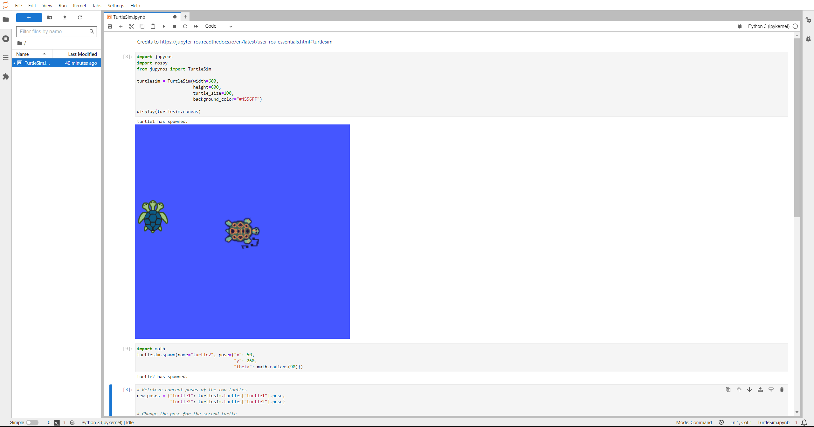

# Jupyter-ROS Docker Image

This Docker image provides a Jupyter environment with ROS (Robot Operating System) capabilities, making it convenient for roboticists and developers working in ROS.

## Cloning the Repository

Before building the Docker image, clone this repository and navigate to the ros-humble-inside-jupyter directory:

```
git clone https://github.com/alunos-pfc/ros_tutorials.git
cd ros_tutorials/ros-humble-inside-jupyter
```

## Building the Image

To build the Docker image, run the following command:

```bash
docker build -t ros-humble-inside-jupyter .
```

## Running the Image

To start the Jupyter server, use the following command:

```bash
docker run -it -p 8888:8888 ros-humble-inside-jupyter
```

## Activating Micromamba Environment and Installing Jupyros

After starting the container, activate the Micromamba environment and install Jupyros using pip by running:

```bash
micromamba activate ros_env
pip install --pre jupyros==0.7.0a0
```

## Starting Jupyter Lab

Once micromamba environment is active and Jupyros is installed, start Jupyter Lab with the following command:

```bash
jupyter lab --port=8888 --no-browser --ip=0.0.0.0 --allow-root
```

Access Jupyter Lab by navigating to the provided link in your web browser.

## Running ROS

In the Jupyter Lab interface, open the TurtleSim notebook and run the code cells to see ROS in action.

It should look like this:
